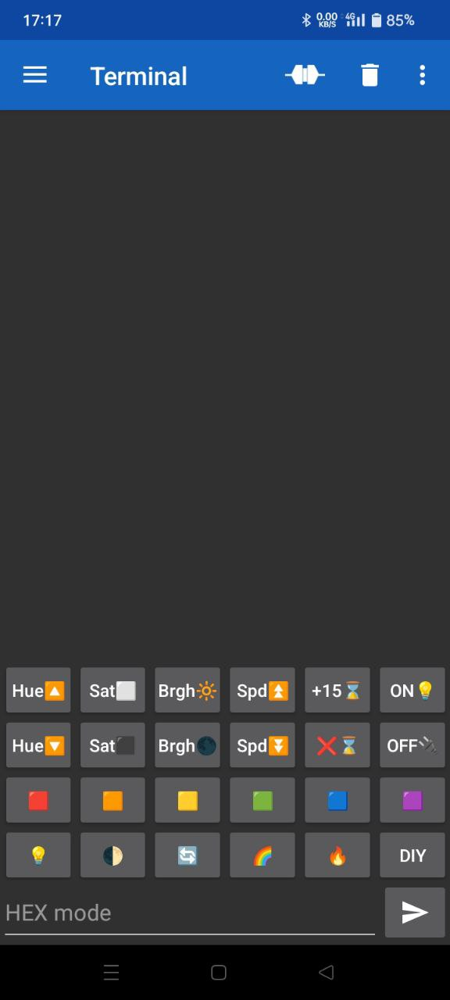

# ArduinoBluetoothBacklight

Arduino Nano firmware for managing addressable LED strip via bluetooth (HC-06).

## Idea
I have:
- Adressable led strip (**ws2812b**);
- Arduino Nano;
- Bluetooth module HC-06.

I want:
- Cool backlight for my room with remote control from my smartphone;

Particulary these functions:
- on / off / off timer;
- color control;
- different color modes.

## Remote protocol
Each message consists of 3 bytes.
1. command code byte;
2. command argument byte;
3. command argument operation byte.

### List of commands
Table of all possible commands and their byte codes:

| Command | Argument | Operation | Description |
| :---: | :---: | :---: | :--- |
| **Power** ||||
| 0x00 | 0x00 | Ignored | turn off |
| 0x00 | 0x01 | Ignored | turn on |
| **Hue** ||||
| 0x01 | 0xXX | 0x00 | set hue to XX |
| 0x01 | 0xXX | 0x01 | decrease hue by XX |
| 0x01 | 0xXX | 0x02 | increase hue by XX |
| **Saturation** ||||
| 0x02 | 0xXX | 0x00 | set saturation to XX |
| 0x02 | 0xXX | 0x01 | decrease saturation by XX |
| 0x02 | 0xXX | 0x02 | increase saturation by XX |
| **Brightness** ||||
| 0x03 | 0xXX | 0x00 | set brightness to XX |
| 0x03 | 0xXX | 0x01 | decrease brightness by XX |
| 0x03 | 0xXX | 0x02 | increase brightness by XX |
| **Speed** ||||
| 0x04 | 0xXX | 0x00 | set speed to XX |
| 0x04 | 0xXX | 0x01 | decrease speed by XX |
| 0x04 | 0xXX | 0x02 | increase speed by XX |
| **Mode** ||||
| 0x05 | 0xXX | Ignored | switch mode to XX |
| **Timer** ||||
| 0x06 | 0xXX | 0x00 | set turn off timer to **XX** minutes |
| 0x06 | 0xXX | 0x02 | increase turn off timer by **XX** minutes |
| 0x06 | Ignored | 0x03 | clear turn off timer |

## References
### Platform
Project is based on [PlatformIO](https://platformio.org/). I use it as VS Code extension.

### Dependencies
- [FastLED](https://github.com/FastLED/FastLED) for easy control led strip. 

### Bluetooth app
As sender app, I recommend [Serial Bluetooth Terminal](https://play.google.com/store/apps/details?id=de.kai_morich.serial_bluetooth_terminal) by Kai Morich. There you can nicely customize interface so it will look like usual remote. 

Use [this configuration file](./bluetooth/keyboard_config.txt) to get your app keyboard looks like on picture below.

 
